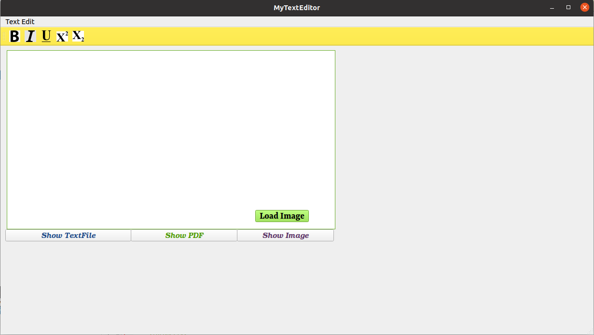

# Text Editor Application created with QT Creator/C++

A Basic text-editing app developed with QT Creator/C++.

### Features/Objectives: Edit Text
1. Bold/Normal the text
2. Italic/Normal the text
3. Underline/Normal the text
4. Superscript
5. Subscript
6. Show Text/HTML file on dialogbox after clicking button
7. Show PDF File after clicking button
8. Show Image File after clicking button
9. Load Image and show it on Qlabel after clicking button
10. Used stylesheet/UI styling
11. Keyboard Shortcuts for each operations

### Ubuntu and Qt version

  - Compiled and Tested on Ubuntu 20.04.2 LTS.
  - QT version: Qt Creator 4.11.0 Based on Qt 5.12.8 (GCC 9.3.0, 64 bit) Copyright 2008-2019 The Qt Company Ltd. All rights reserved.

### Installation

1. Install qt5: sudo apt-get install qt5-default
2. Download zip file of this code
3. Extract it on your local directory
4. go to terminal
5. go to the extracted folder path "Text-Editor-Qt-master"
6. follow these commands
```
$ cd Text-Editor-Qt-master
$ qmake Text-Editor.pro
$ make
```

### How to run the code?

* Execute file Text-Editor in folder "Text-Editor"
```sh
$ ./Text-Editor
```

### What has been done?

Three files are main for this project, on which changes are done:
1. mytexteditor.cpp: Backend functionality/C++; You can refer the code for more refernece for each above mentioned features.
2. mytexteditor.ui: UI frontend functionality; Addwidget; designing; styling; go to slot feature and many more.
3. resource file: datafiles and icons are stored here; You have to call Add Existing file each time when you insert a new file in directory. I have added datafile and icons by this calling.

* CREATING A NEW PROJECT : In QT Creator, a QT widgets application is created.

`File -> New File or Project -> Application -> QT Widgets Application (Choose) -> Name & Location (Next) -> Desktop Kit (Next) -> Classname: MyTextEditor (Next) -> Finish`

* DESIGNING UI : 
Open `mytexteditor.ui` file in QT Creator. Drag and Drop a "Text Edit" Input Widget into the editor area. I

* Add "Text Edit" in menu bar and on the suboption add "Bold" in it. An action is created. Drag the action onto the task bar. Tick checkable for the action.

* Add Resources :
* To add an icon for "Bold" : 

``Text-Editor -> add New -> Qt -> Qt Resource File (Choose) -> Name (AppResources) & Location (inside Text-Editor) (Next) -> Finish.``

In the `appresources.qrc` file in "Resources", add a prefix `\Images` and add a file (bold.png) inside Images.
``"Edit action" of "Bold Action" -> Icon (select)``

* Backend Programming :
* Right Click the action -> "Go to Slot" -> Triggered (bool) (Ok). Function "on_actionBold_triggered(bool checked)" is created in "mytexteditor.cpp" . Add this line inside the function. 

```sh
checked ? ui->textEdit->setFontWeight(QFont::Bold) :
          ui->textEdit->setFontWeight(QFont::Normal);
```
 
* I have added remaining features by this way.
* You can add style by doing right click on that object and choose 'Change Stylesheet' and then you can add font and color.
* If you want to change button background, select pallete section on bottom right window and then choose color and then apply.
* Build and Run the application or press Ctrl+R

### Issues / Challenges ? 

1. A depth understanding is required for using the software.
2. Sometimes layout becomes messy.
3. Do not know how to load PDF file on QLabel widget.
4. Proper labelling is required of UI objects before calling them.

### Useful Links:
1. https://www.cppbuzz.com/projects/c++/qt-c++-project-on-notepad
2. https://code.woboq.org/qt5/qttools/src/designer/src/lib/shared/richtexteditor.cpp.html
3. https://stackoverflow.com/questions/1357960/qt-jpg-image-display
4. https://www.programmersought.com/article/96575736142/
5. https://forum.qt.io/topic/82420/show-picture-using-qlabel-and-pixmap/5
6. https://github.com/nymika/Text-Editor-Qt

### Result:

